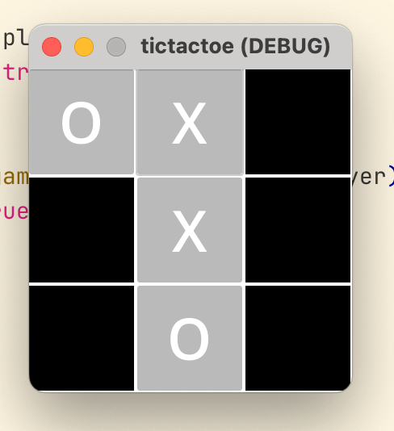
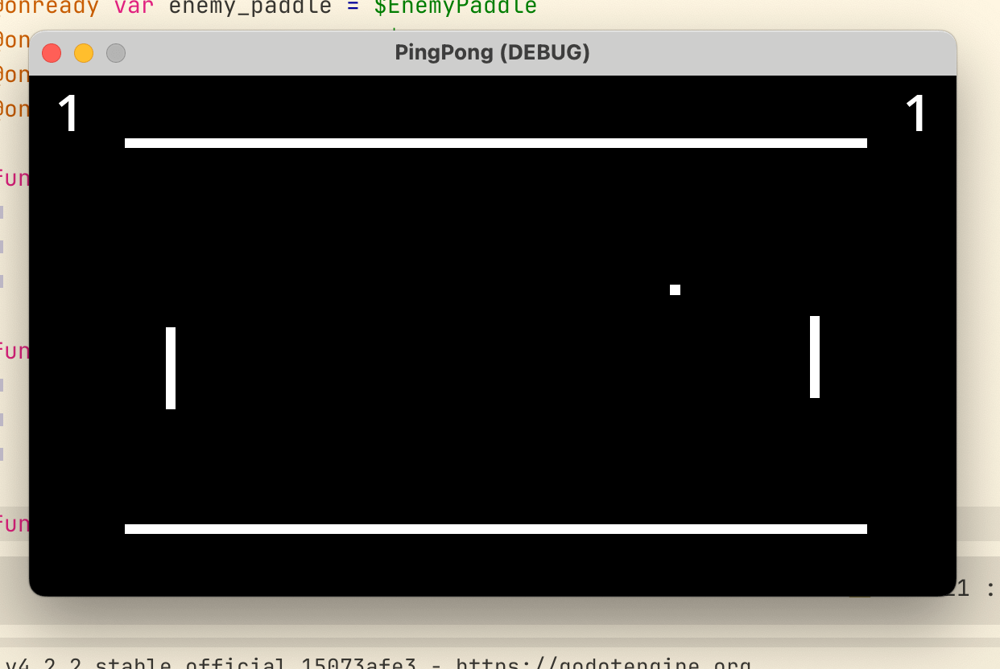
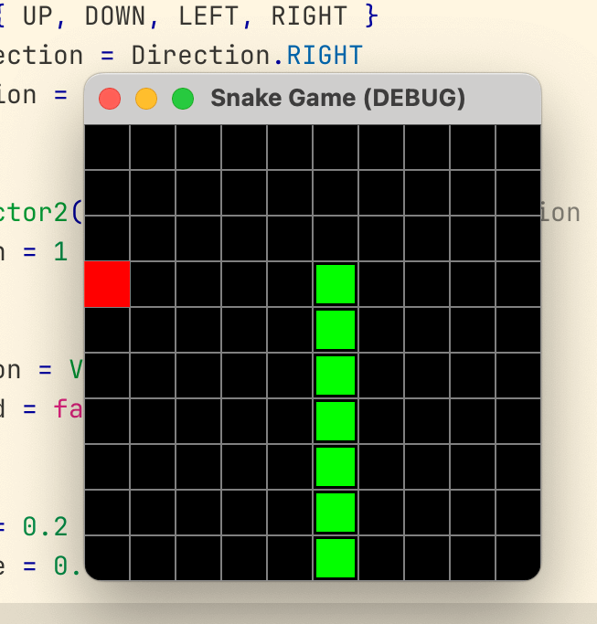
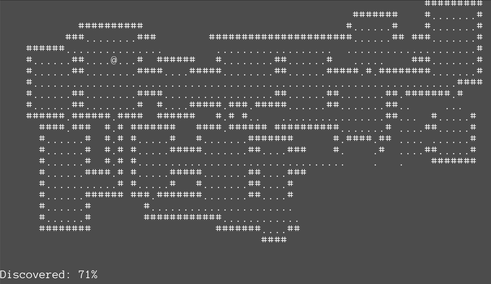
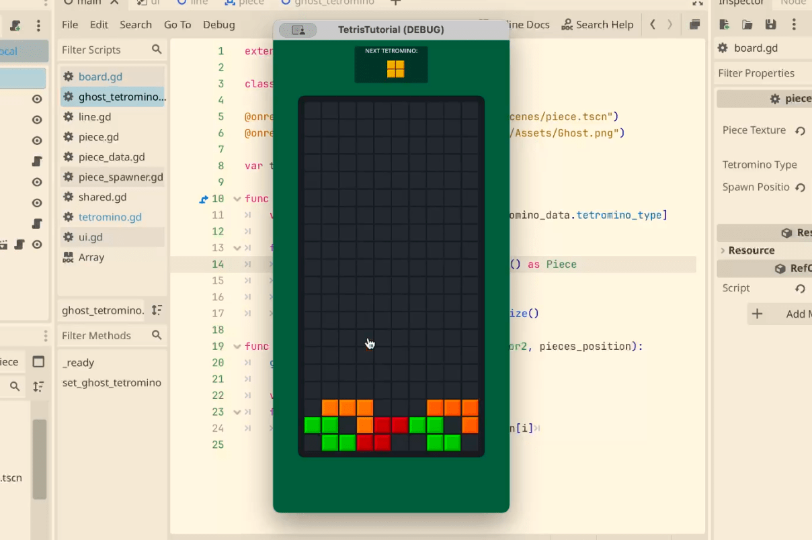
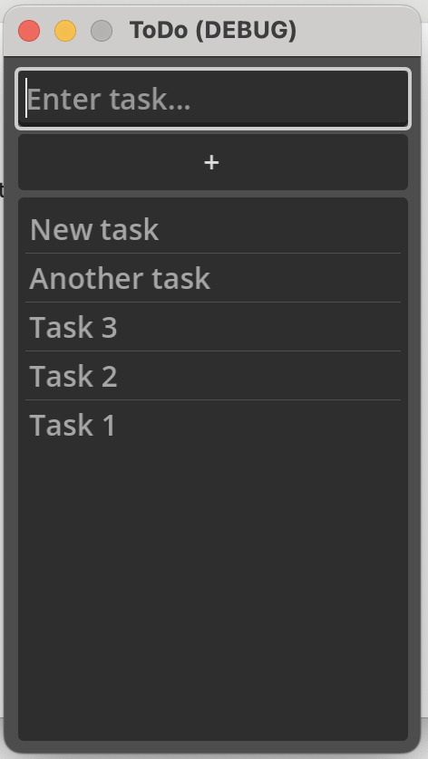
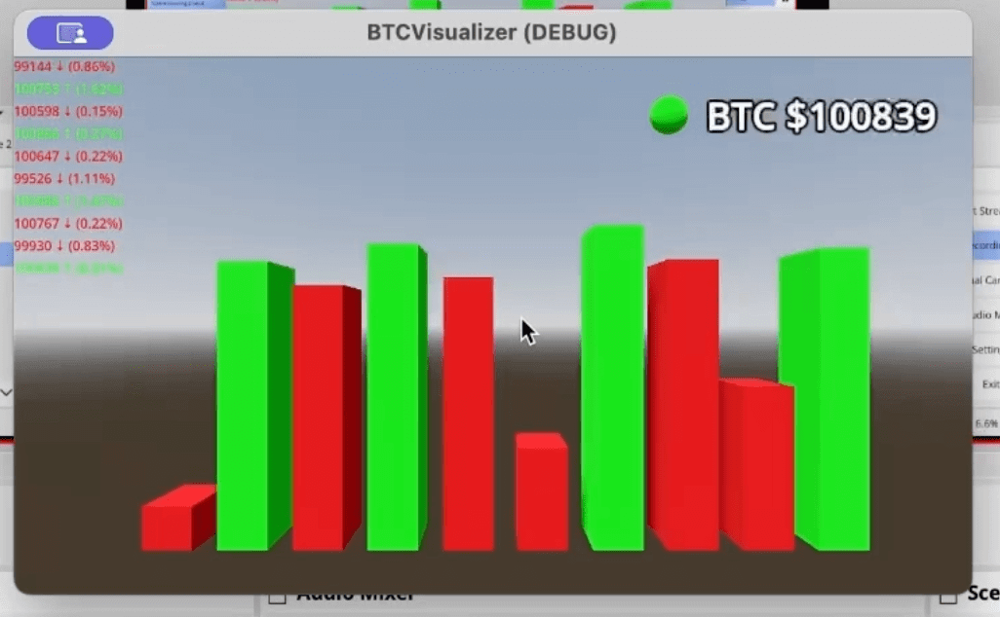
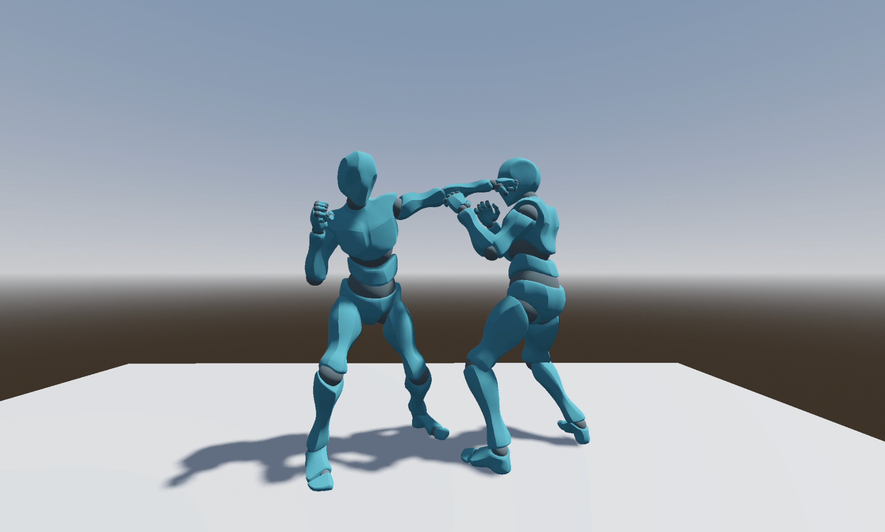

# GODOT Projects Collection 🎮

## 🕹️ 2D Classic Games

### 1. Tic Tac Toe
**Dir:** `2d-classic-games/tic-tac-toe`  

  

### 2. Ping Pong
**Dir:** `2d-classic-games/ping-pong`  

  

### 3. Snake
**Dir:** `2d-classic-games/snake`  

  

### 4. Rogue
**Dir:** `2d-classic-games/rogue`  

  

### 5. Tetris
**Dir:** `2d-classic-games/tetris`

  

## Other

### 1. ToDo application
**Dir:** `todo`

  

### 2. Bitcoin visualizer with mock data - part 1
**Dir:** `3d/btcvisualizer-mock`

  

### 3. Bitcoin visualizer with live data - part 2
**Dir:** `3d/btcvisualizer-live`

  

### 4. Punch test
**Dir:** `3d/punchtest`

  

## 🛠️ Requirements
- Godot Engine 4.0+
